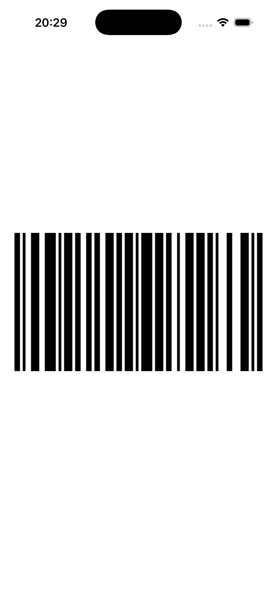

# GS1BarcodeGenerator

Don't forget to give it a ⭐️ if this package helped you out.

A GS1 Code 128 barcode generator Swift Package for iOS &amp; MacOS based on the [boombuler/barcode](https://github.com/boombuler/barcode) golang code128 generator. This github repo is taking the golang package, & exposes one of it's functions in an xcframework with the help of [gomobile](https://pkg.go.dev/golang.org/x/mobile/cmd/gomobile). Wrapper functions are created in Swift to make the code easily consumable.

It's able to generate GS1 Code 128 barcode images, which you can easily display in your projects.

**Important: make sure you are not referencing main / any other branch when you are adding the package to your project! main doesn't have the go code built into an XCFramework. Always load a release tag, for example `1.0.0`.**

## Result of 01234 encoded using this library



## Example usage with SwiftUI (both iOS & MacOS)

```swift
import SwiftUI
import GS1BarcodeGenerator


struct ContentView: View {
    
    var body: some View {
        VStack {
            try? generateGS1BarcodeImage(from: "01234", size: .init(width: 400, height: 200))
        }
        .padding()
    }
}
```

## Example usage with UIKit (iOS)

```swift
import UIKit
import GS1BarcodeGenerator

class ViewController: UIViewController {
    
    let imageView = UIImageView()

    override func viewDidLoad() {
        super.viewDidLoad()
        
        view.addSubview(imageView)
        
        imageView.translatesAutoresizingMaskIntoConstraints = false
        
        NSLayoutConstraint.activate([
            imageView.centerXAnchor.constraint(equalTo: view.centerXAnchor),
            imageView.centerYAnchor.constraint(equalTo: view.centerYAnchor),
        ])
        
        imageView.image = try? generateGS1BarcodeUIImage(from: "01234", size: .init(width: 400, height: 200))
    }
}
```

## Example usage with Cocoa (macOS)
```swift
import Cocoa
import GS1BarcodeGenerator

class ViewController: NSViewController {
    
    private let imageView = NSImageView()

    override func viewDidLoad() {
        super.viewDidLoad()
        
        view.addSubview(imageView)
        imageView.translatesAutoresizingMaskIntoConstraints = false
        
        NSLayoutConstraint.activate([
            imageView.centerXAnchor.constraint(equalTo: view.centerXAnchor),
            imageView.centerYAnchor.constraint(equalTo: view.centerYAnchor)
        ])
        
        imageView.image = try? generateGS1BarcodeNSImage(from: "01234", size: .init(width: 400, height: 200))
    }

    override var representedObject: Any? {
        didSet {
            
        }
    }
}
```
